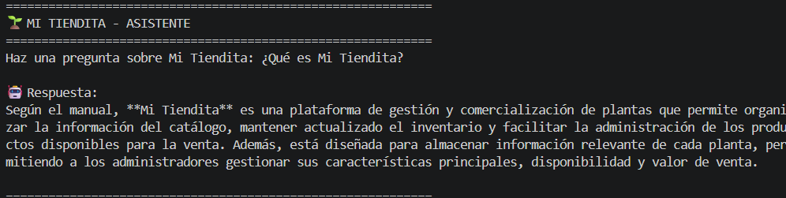
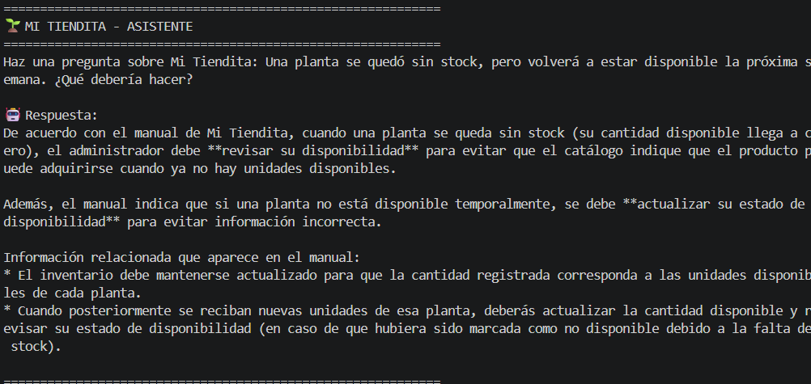
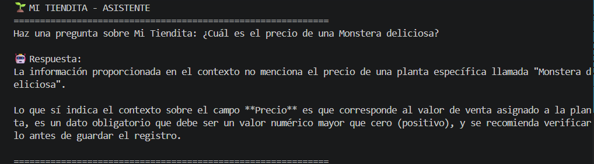

# 🤖 Mi Tiendita AI Agent

> Proyecto desarrollado para el programa **AI ONE for Tech** de **Alura Latam** - 2026

Este proyecto implementa un agente de inteligencia artificial diseñado para **Mi Tiendita**, una tienda de e-commerce de plantas desarrollada originalmente como proyecto [Full Stack](https://github.com/ndevia/mi-tiendita). 

El agente utiliza el manual operativo de la aplicación como base de conocimiento para responder preguntas relacionadas con la gestión del catálogo.

## 🔎 Características principales

- **Arquitectura RAG**: Recupera información relevante del manual operativo antes de generar una respuesta.
- **Procesamiento de documentos PDF**: Utiliza el manual operativo de Mi Tiendita como fuente de información.
- **Embeddings**: Convierte los fragmentos del documento en representaciones vectoriales mediante Google Gemini.
- **Base de Datos Vectorial**: Emplea FAISS para almacenar y buscar fragmentos semánticamente similares.
- **Agente de IA**: Utiliza un modelo Gemini para generar respuestas basadas en la información recuperada.

## 🛠️ Tecnologías utilizadas

- **Lenguaje**: Python
- **Frameworks**: LangChain
- **LLM & Embeddings**: Google Gemini API (`langchain-google-genai`)
- **Vector Store**: FAISS
- **Utilidades**: python-dotenv, PyPDF

## 📝 Requisitos previos

- Python 3.13 o superior
- Una API Key de Google Gemini

*La API Key debe configurarse mediante una variable de entorno*

## 🚀 Instalación y Configuración

#### 1. Clonar el repositorio:
- git clone https://github.com/ndevia/mi-tiendita-ai-agent

#### 2. Navegar a la carpeta del proyecto:
- cd mi-tiendita-ai-agent

#### 3. Crear entorno virtual:
**Windows**:
- python -m venv .venv

**macOS / Linux**:
- python3 -m venv .venv

#### 4. Activar entorno virtual
**Windows - Git Bash**
- source .venv/Scripts/activate

**Windows - PowerShell**
- .venv\Scripts\Activate.ps1

**Windows - CMD**
- .venv\Scripts\activate.bat

**macOS / Linux**
- source .venv/bin/activate

*Si se desea, el entorno virtual se puede desactivar utilizando el comando `deactivate` en la terminal* 

#### 5. Instalar las dependencias:
- pip install -r requirements.txt

#### 6. Crear un archivo `.env` en la raíz del proyecto y agregar la API Key de Google Gemini:

```env
GEMINI_API_KEY=TU_API_KEY
```
*Reemplaza **`TU_API_KEY`** por la API Key de Google Gemini*

## 💻 Cómo Ejecutar

#### 1. Ejecutar en la terminal:
- python src/main.py

#### 2. Realizar una pregunta:
El programa solicitará una pregunta sobre Mi Tiendita y generará una respuesta utilizando información recuperada del manual operativo de la aplicación.

## 📁 Estructura del proyecto

```text
mi-tiendita-ai-agent/
├── docs/
│   └── manual.pdf
├── src/
│   ├── agent.py
│   ├── knowledge_base.py
│   ├── main.py
│   └── utils.py
├── .gitignore
├── README.md
└── requirements.txt
```

- **`docs/manual.pdf`**: manual utilizado como fuente de conocimiento.
- **`src/utils.py`**: lectura y división del documento.
- **`src/knowledge_base.py`**: generación de embeddings y búsqueda semántica con FAISS.
- **`src/agent.py`**: configuración e interacción con el agente.
- **`src/main.py`**: flujo principal de la aplicación.

## 💬 Ejemplos de preguntas y respuestas

### ✔️ Preguntas sobre información que se encuentra en el manual

#### Información sobre la plataforma
**Pregunta:**
> ¿Qué es Mi Tiendita?

**Respuesta:**



#### Gestión del inventario
**Pregunta:**
> Una planta se quedó sin stock, pero volverá a estar disponible la próxima semana. ¿Qué debería hacer?

**Respuesta:**



### ✖️ Preguntas sobre información que no se encuentra en el manual

#### Precio de una planta específica
**Pregunta:**
> ¿Cuál es el precio de una Monstera deliciosa?

**Respuesta:**



## 🚧 Mejoras futuras
- Mejorar la naturalidad y consistencia de las respuestas del agente.
- Incorporar una interfaz gráfica utilizando Streamlit.
- Persistir la base vectorial para evitar generar nuevamente los embeddings en cada ejecución.
- Evaluar la migración de FAISS desde langchain-community hacia una integración. independiente, considerando las recomendaciones y cambios futuros del ecosistema LangChain
- Incorporar nuevas funcionalidades al catálogo, como imágenes y descripciones detalladas.
- Implementar roles de usuario y respuestas adaptadas según el tipo de usuario.
- Integrar documentación adicional, como información para clientes y administradores.
- Implementar un sistema de evaluación para medir la calidad de las respuestas del agente.